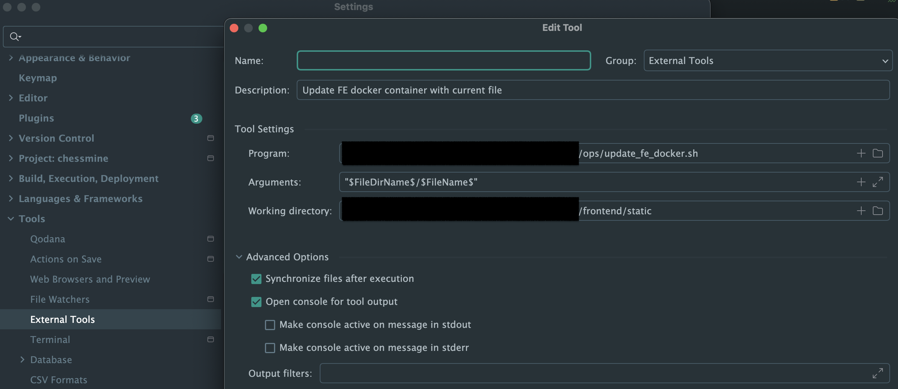

## Local development

When changing one of the files within the _/static_ folder, you can use the *ops/update_fe_docker.sh* script to inject
the changed file into the caddy container and then simply reload tha page in the browser to receive the updated file. 
Make sure the caching of the browser is turned off, otherwise it may not fetch the file from the webserver.
The script expects a single argument of the file path under the _/static_ folder. For example for changing the game.js,
the invocation will be with the argument _js/game.js_. Here's an example configuration from PyCharm to run the script as
External Tool:



## Run caddy container from master

Caddy runs an official image with a set version. If you want to run caddy from latest master follow the below steps.

Build caddy image with dockerfile that builds from source:
```
docker build -f DockerfileCaddyMaster -t caddy_master --build-arg APP_URL=http://localhost --build-arg BE_URL=host.docker.internal .
```
Next run the docker compose which spins all containers but caddy:
```
docker compose -f docker-compose-debug-caddy.yml up -d --build --force-recreate
```
Finally run the image we built for caddy and expose port 80:
```
docker run -p 80:80 -it caddy_master caddy/cmd/caddy/caddy run --config Caddyfile
```

Navigate to localhost/ to reach the site.